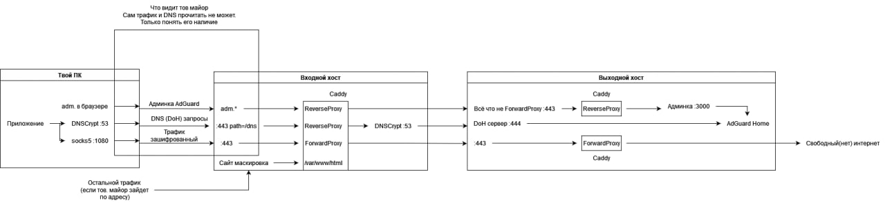

# NaiveProxy + AdGuard

Настройка, нацеленная на приватность и анонимность.

## Преимущества

- Без зависимости от MITM в лице Cloudflare.
- Без непонятных примеров на китайском.
- Без пердолинга. Просто скопировать команды и запустить Docker.
- Лучшие на последний момент технологии.
- Два сервера вместо одного - IP будет отличаться от того, к которому провайдер видит подключение.
- Фильтрующий DNS от AdGuard Home.

## Недостатки

- Два сервера вместо одного. Получится аж рублей на 300-400 дороже. Для скуфа с завода это катастрофа.\
  Хотя если чуть изменить конфиги, то все можно уместить один. Но тогда пропадает вся анонимность.
- Всё ещё не в один клик. Много ручной работу можно уместить в скрипты наподобии как в Outline.

## Требования

- Знание что такое SSH и способность зайти по нему на сервер.
- Знание как печатать буквы в консоль.
- Умение внимательно читать.
- Наличие как минимум 1% функционирующих нервных клеток в неокортексе.
- Два хоста с Debian 11. Можно и другой дистрибутив, но эта штабильная и тестировалось всё на ней.
- Домен. Можно взять бесплатный на Freenom.

## Схема работы



## Где взять сервера

- Из [этой](https://habr.com/ru/post/678458/) статьи на хабре.
- Из [этого](https://bitcoin-vps.com/) списка хостеров с криптой. Надо быть осторожным и не попасть на скам.
- Личная рекомендация: [Aeza](https://aeza.net/) [Рефка](https://aeza.net/?ref=362413) - очень дешевый реселл популярных иностранных хостеров от 355р/мес и почасовая оплата.

## Установка

**Внимательно читайте каждую букву в каждом пунтке!**

Заходим по SSH на первый сервер. Он является входным.

Выполняем [настройку](docs/init.md) окружения.

После этого **с певрого сервера** заходим по SSH на второй. Ваш ПК никак не должен быть связан с ним.

Выполняем так же [настройку](docs/init.md) его окружения.

Заходим в DNS вашего домена и добавляем там две записи:

```
A @ IP входного сервера
A adm IP входного сервера

@ это root запись, в разных провайдерах она может быть по разному. Если не работает - введите сам домен.
adm это поддомен для управления AdGuard.
```

С вашего ПК загружаем на первый сервер папки out и naive:

```bash
$ scp -P 2323 -r naive/* admin@$IP:/home/admin/
$ scp -P 2323 -r out admin@$IP:/home/admin/
# $IP заменить на айпи адрес сервера.
```

На второй сервер **с первого** переносим директорию `out`:

```bash
$ scp -P 2323 -r out/* admin@$IP:/home/admin/
# $IP заменить на айпи адрес сервера.
```

Через SSH с первого сервера приступаем к [настройке](out/README.md) второго.

После перенесения сертификата [настраиваем](naive/README.md) уже первый сервер.

Всё готово. Осталось только [подключить](client/README.md) клиенты.

## TODO

- Скрипт для добавления Naive в автозагрузку.
- Гайд по основным ошибкам.
- Больше автоматизации.
- Улучшить инструкции для идиотов.
- Разнести эту базу в массы.
